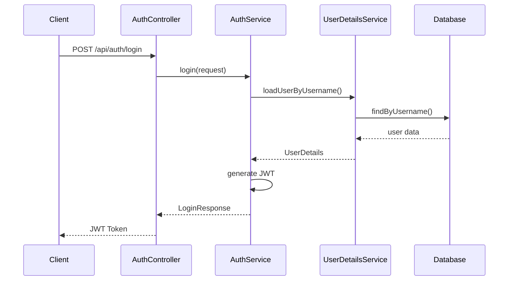
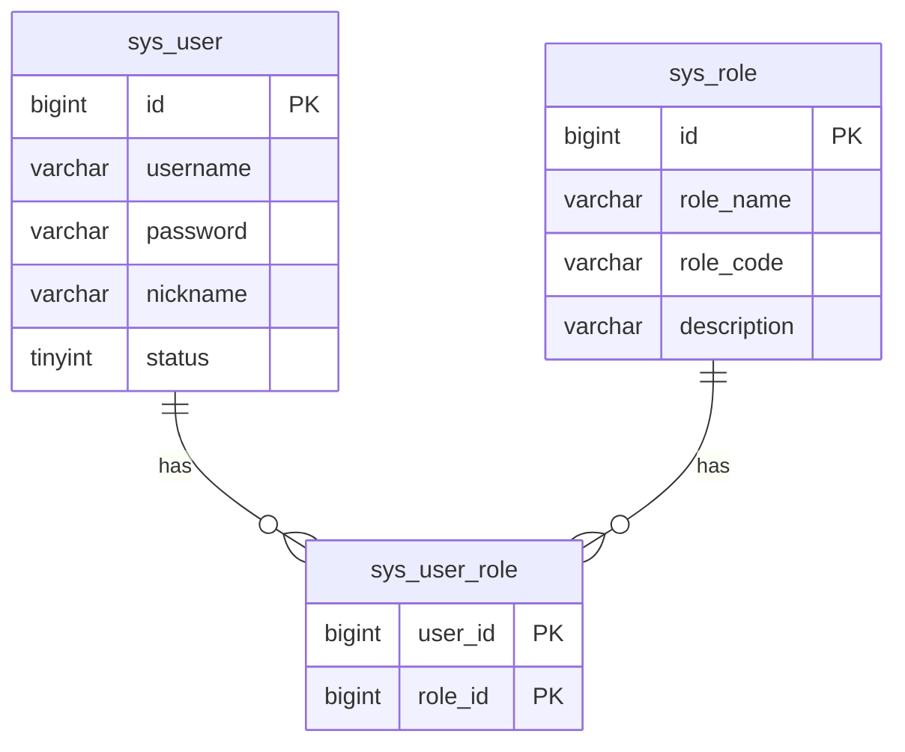

# Spring Boot + MyBatis Plus + Swagger + Security + JWT 项目教程

## 目录
1. [项目初始化](#1-项目初始化)
2. [添加 MyBatis Plus](#2-添加-mybatis-plus)
3. [添加 Swagger](#3-添加-swagger)
4. [数据库配置](#4-数据库配置)
5. [测试数据](#5-测试数据)
6. [添加 Spring Security](#6-添加-spring-security)
7. [集成 JWT](#7-集成-jwt)
8. [认证授权配置](#8-认证授权配置)

## 1. 项目初始化

### 1.1 基础依赖配置
在 `pom.xml` 中添加必要的依赖：

```xml
<?xml version="1.0" encoding="UTF-8"?>
<project xmlns="http://maven.apache.org/POM/4.0.0"
         xmlns:xsi="http://www.w3.org/2001/XMLSchema-instance"
         xsi:schemaLocation="http://maven.apache.org/POM/4.0.0 http://maven.apache.org/xsd/maven-4.0.0.xsd">
    <modelVersion>4.0.0</modelVersion>

    <parent>
        <groupId>org.springframework.boot</groupId>
        <artifactId>spring-boot-starter-parent</artifactId>
        <version>3.1.0</version>
        <relativePath/>
    </parent>

    <groupId>org.example</groupId>
    <artifactId>test_java</artifactId>
    <version>1.0-SNAPSHOT</version>

    <properties>
        <maven.compiler.source>23</maven.compiler.source>
        <maven.compiler.target>23</maven.compiler.target>
        <project.build.sourceEncoding>UTF-8</project.build.sourceEncoding>
    </properties>

    <repositories>
        <repository>
            <id>aliyun</id>
            <url>https://maven.aliyun.com/repository/public</url>
            <releases>
                <enabled>true</enabled>
            </releases>
            <snapshots>
                <enabled>false</enabled>
            </snapshots>
        </repository>
    </repositories>

    <dependencies>
        <!-- Spring Boot Web -->
        <dependency>
            <groupId>org.springframework.boot</groupId>
            <artifactId>spring-boot-starter-web</artifactId>
        </dependency>

        <!-- MySQL -->
        <dependency>
            <groupId>mysql</groupId>
            <artifactId>mysql-connector-java</artifactId>
            <version>8.0.33</version>
        </dependency>

        <!-- Lombok -->
        <dependency>
            <groupId>org.projectlombok</groupId>
            <artifactId>lombok</artifactId>
            <version>1.18.30</version>
            <scope>provided</scope>
        </dependency>
    </dependencies>

    <build>
        <plugins>
            <plugin>
                <groupId>org.springframework.boot</groupId>
                <artifactId>spring-boot-maven-plugin</artifactId>
                <version>3.1.0</version>
            </plugin>
        </plugins>
    </build>
</project>
```

### 1.2 创建主启动类

```java
package org.example;

import org.springframework.boot.SpringApplication;
import org.springframework.boot.autoconfigure.SpringBootApplication;

@SpringBootApplication
public class Main {
    public static void main(String[] args) {
        SpringApplication.run(Main.class, args);
    }
}
```

## 2. 添加 MyBatis Plus

### 2.1 添加依赖
在 `pom.xml` 的 `dependencies` 中添加：

```xml
<!-- MyBatis Plus -->
<dependency>
    <groupId>com.baomidou</groupId>
    <artifactId>mybatis-plus-boot-starter</artifactId>
    <version>3.5.4.1</version>
</dependency>
```

### 2.2 配置数据源
创建 `application.yml` 文件：

```yaml
spring:
  datasource:
    driver-class-name: com.mysql.cj.jdbc.Driver
    url: jdbc:mysql://localhost:3306/test_db?useSSL=false&serverTimezone=UTC
    username: root
    password: 123456

mybatis-plus:
  configuration:
    log-impl: org.apache.ibatis.logging.stdout.StdOutImpl
    map-underscore-to-camel-case: true
  global-config:
    db-config:
      id-type: auto
  type-aliases-package: org.example.entity
```

### 2.3 创建实体类

```java
package org.example.entity;

import com.baomidou.mybatisplus.annotation.IdType;
import com.baomidou.mybatisplus.annotation.TableId;
import com.baomidou.mybatisplus.annotation.TableName;
import lombok.Data;

@Data
@TableName("user")
public class User {
    @TableId(type = IdType.AUTO)
    private Long id;
    private String name;
    private Integer age;
    private String email;
}
```

### 2.4 创建 Mapper

```java
package org.example.mapper;

import com.baomidou.mybatisplus.core.mapper.BaseMapper;
import org.example.entity.User;
import org.apache.ibatis.annotations.Mapper;

@Mapper
public interface UserMapper extends BaseMapper<User> {
}
```

### 2.5 创建 Service

```java
package org.example.service;

import com.baomidou.mybatisplus.extension.service.IService;
import org.example.entity.User;

public interface UserService extends IService<User> {
}
```

### 2.6 创建 Service 实现类

```java
package org.example.service.impl;

import com.baomidou.mybatisplus.extension.service.impl.ServiceImpl;
import org.example.entity.User;
import org.example.mapper.UserMapper;
import org.example.service.UserService;
import org.springframework.stereotype.Service;

@Service
public class UserServiceImpl extends ServiceImpl<UserMapper, User> implements UserService {
}
```

## 3. 添加 Swagger

### 3.1 添加依赖
在 `pom.xml` 的 `dependencies` 中添加：

```xml
<!-- SpringDoc OpenAPI (Swagger) -->
<dependency>
    <groupId>org.springdoc</groupId>
    <artifactId>springdoc-openapi-starter-webmvc-ui</artifactId>
    <version>2.3.0</version>
</dependency>
```

### 3.2 创建 Swagger 配置类

```java
package org.example.config;

import io.swagger.v3.oas.models.OpenAPI;
import io.swagger.v3.oas.models.info.Info;
import io.swagger.v3.oas.models.info.Contact;
import org.springframework.context.annotation.Bean;
import org.springframework.context.annotation.Configuration;

@Configuration
public class SwaggerConfig {
    @Bean
    public OpenAPI springShopOpenAPI() {
        return new OpenAPI()
                .info(new Info()
                        .title("测试项目 API 文档")
                        .description("使用 Spring Boot 3 + MyBatis Plus")
                        .version("v1.0")
                        .contact(new Contact()
                                .name("Your Name")
                                .email("your.email@example.com")));
    }
}
```

### 3.3 添加 Swagger 配置
在 `application.yml` 中添加：

```yaml
springdoc:
  swagger-ui:
    path: /swagger-ui.html
  api-docs:
    path: /v3/api-docs
  packages-to-scan: org.example.controller
```

### 3.4 创建 Controller 并添加 Swagger 注解

```java
package org.example.controller;

import io.swagger.v3.oas.annotations.Operation;
import io.swagger.v3.oas.annotations.tags.Tag;
import org.example.service.UserService;
import org.example.entity.User;
import org.springframework.beans.factory.annotation.Autowired;
import org.springframework.web.bind.annotation.*;

@Tag(name = "用户管理", description = "用户管理相关接口")
@RestController
@RequestMapping("/user")
public class UserController {
    @Autowired
    private UserService userService;

    @Operation(summary = "获取用户信息", description = "根据用户ID获取用户信息")
    @GetMapping("/{id}")
    public User getUser(@PathVariable Long id) {
        return userService.getById(id);
    }

    @Operation(summary = "创建用户", description = "创建新用户")
    @PostMapping
    public boolean save(@RequestBody User user) {
        return userService.save(user);
    }
}
```

## 4. 数据库配置

### 4.1 创建数据库和表
执行以下 SQL 语句：

```sql
-- 创建数据库
CREATE DATABASE IF NOT EXISTS test_db;
USE test_db;

-- 创建用户表
CREATE TABLE IF NOT EXISTS user (
    id BIGINT NOT NULL AUTO_INCREMENT,
    name VARCHAR(30) NULL DEFAULT NULL,
    age INT NULL DEFAULT NULL,
    email VARCHAR(50) NULL DEFAULT NULL,
    PRIMARY KEY (id)
);
```

## 5. 测试数据

### 5.1 插入测试数据

```sql
-- 插入测试数据
INSERT INTO user (name, age, email) VALUES
('张三', 25, 'zhangsan@example.com'),
('李四', 30, 'lisi@example.com'),
('王五', 28, 'wangwu@example.com'),
('赵六', 35, 'zhaoliu@example.com'),
('孙七', 22, 'sunqi@example.com');

-- 验证数据
SELECT * FROM user;
```

### 5.2 生成大量测试数据（可选）

```sql
-- 创建存储过程生成测试数据
DELIMITER //
CREATE PROCEDURE generate_test_data(IN num INT)
BEGIN
    DECLARE i INT DEFAULT 0;
    WHILE i < num DO
        INSERT INTO user (name, age, email) VALUES
        (
            CONCAT(
                ELT(FLOOR(1 + RAND() * 100) % 10, '张', '李', '王', '赵', '孙', '周', '吴', '郑', '刘', '陈'),
                ELT(FLOOR(1 + RAND() * 100) % 10, '一', '二', '三', '四', '五', '六', '七', '八', '九', '十')
            ),
            FLOOR(18 + RAND() * 42),
            CONCAT(
                LOWER(
                    CONCAT(
                        CHAR(FLOOR(97 + RAND() * 26)),
                        CHAR(FLOOR(97 + RAND() * 26)),
                        CHAR(FLOOR(97 + RAND() * 26)),
                        CHAR(FLOOR(97 + RAND() * 26)),
                        CHAR(FLOOR(97 + RAND() * 26))
                    )
                ),
                '@example.com'
            )
        );
        SET i = i + 1;
    END WHILE;
END //
DELIMITER ;

-- 执行存储过程，生成100条测试数据
CALL generate_test_data(100);

-- 删除存储过程（可选）
DROP PROCEDURE IF EXISTS generate_test_data;
```

## 6. 添加 Spring Security

### 6.1 添加依赖
在 `pom.xml` 中添加：

```xml
<!-- Spring Security -->
<dependency>
    <groupId>org.springframework.boot</groupId>
    <artifactId>spring-boot-starter-security</artifactId>
</dependency>

<!-- JWT -->
<dependency>
    <groupId>io.jsonwebtoken</groupId>
    <artifactId>jjwt-api</artifactId>
    <version>0.11.5</version>
</dependency>
```

### 6.2 认证流程图



### 6.3 数据库表结构



### 6.4 创建认证相关表
```sql
-- 创建用户表
CREATE TABLE sys_user (
    id BIGINT NOT NULL AUTO_INCREMENT,
    username VARCHAR(50) NOT NULL UNIQUE,
    password VARCHAR(100) NOT NULL,
    nickname VARCHAR(50),
    status TINYINT DEFAULT 1,
    create_time DATETIME DEFAULT CURRENT_TIMESTAMP,
    update_time DATETIME DEFAULT CURRENT_TIMESTAMP ON UPDATE CURRENT_TIMESTAMP,
    PRIMARY KEY (id)
);

-- 创建角色表
CREATE TABLE sys_role (
    id BIGINT NOT NULL AUTO_INCREMENT,
    role_name VARCHAR(50) NOT NULL,
    role_code VARCHAR(50) NOT NULL UNIQUE,
    description VARCHAR(200),
    create_time DATETIME DEFAULT CURRENT_TIMESTAMP,
    update_time DATETIME DEFAULT CURRENT_TIMESTAMP ON UPDATE CURRENT_TIMESTAMP,
    PRIMARY KEY (id)
);

-- 创建用户角色关联表
CREATE TABLE sys_user_role (
    user_id BIGINT NOT NULL,
    role_id BIGINT NOT NULL,
    PRIMARY KEY (user_id, role_id)
);
```

### 6.5 实现 UserDetailsService
```java
package org.example.security.service;

import lombok.RequiredArgsConstructor;
import org.example.entity.SysUser;
import org.example.mapper.SysUserMapper;
import org.slf4j.Logger;
import org.slf4j.LoggerFactory;
import org.springframework.security.core.authority.SimpleGrantedAuthority;
import org.springframework.security.core.userdetails.User;
import org.springframework.security.core.userdetails.UserDetails;
import org.springframework.security.core.userdetails.UserDetailsService;
import org.springframework.security.core.userdetails.UsernameNotFoundException;
import org.springframework.stereotype.Service;

import java.util.List;
import java.util.stream.Collectors;

@Service
@RequiredArgsConstructor
public class UserDetailsServiceImpl implements UserDetailsService {

    private final SysUserMapper sysUserMapper;
    private static final Logger log = LoggerFactory.getLogger(UserDetailsServiceImpl.class);

    @Override
    public UserDetails loadUserByUsername(String username) throws UsernameNotFoundException {
        // 查询用户
        SysUser user = sysUserMapper.findByUsername(username);
        if (user == null) {
            throw new UsernameNotFoundException("用户名或密码错误");
        }
        
        log.info("找到用户: {}", user.getUsername());
        log.info("数据库密码: {}", user.getPassword());
        log.info("用户状态: {}", user.getStatus());
        
        // 查询用户角色
        List<String> roles = sysUserMapper.findUserRoles(user.getId());
        log.info("用户角色: {}", roles);
        
        // 转换为 Spring Security 的 Authority
        List<SimpleGrantedAuthority> authorities = roles.stream()
                .map(SimpleGrantedAuthority::new)
                .collect(Collectors.toList());

        // 返回 UserDetails 对象
        return new User(
            user.getUsername(),
            user.getPassword(),
            user.getStatus() == 1,
            true,
            true,
            true,
            authorities
        );
    }
} 
```

### 6.6 创建认证控制器
```java
package org.example.security.controller;

import io.swagger.v3.oas.annotations.Operation;
import io.swagger.v3.oas.annotations.tags.Tag;
import jakarta.validation.Valid;
import lombok.RequiredArgsConstructor;
import org.example.common.result.R;
import org.example.security.dto.LoginRequest;
import org.example.security.dto.LoginResponse;
import org.example.security.service.AuthService;
import org.springframework.web.bind.annotation.PostMapping;
import org.springframework.web.bind.annotation.RequestBody;
import org.springframework.web.bind.annotation.RequestMapping;
import org.springframework.web.bind.annotation.RestController;

@Tag(name = "认证管理", description = "认证相关接口")
@RestController
@RequestMapping("/api/auth")
@RequiredArgsConstructor
public class AuthController {

    private final AuthService authService;

    @Operation(summary = "用户登录", description = "用户登录并获取令牌")
    @PostMapping("/login")
    public R<LoginResponse> login(@Valid @RequestBody LoginRequest request) {
        return authService.login(request);
    }
} 
```

## 7. JWT 配置

### 7.1 JWT 工具类
创建 `JwtUtil.java`:

```java
@Component
public class JwtUtil {
    @Value("${jwt.secret}")
    private String secret;
    
    @Value("${jwt.expiration}")
    private Long expiration;
    
    public String generateToken(UserDetails userDetails) {
        Map<String, Object> claims = new HashMap<>();
        claims.put("sub", userDetails.getUsername());
        claims.put("created", new Date());
        claims.put("authorities", userDetails.getAuthorities());
        
        return generateToken(claims);
    }
}
```

### 7.2 配置文件
在 `application.yml` 中添加：

```yaml
jwt:
  secret: your_jwt_secret_key_must_be_very_long_and_secure
  expiration: 86400000  # 24小时
```

## 8. 测试认证

### 8.1 生成测试用户
```sql
-- 插入测试用户数据（密码：123456）
INSERT INTO sys_user (username, password, nickname, status) VALUES
('admin', '$2a$10$X/uMNuiw3UZKzefO5w.NTOoEdxD7ZN3GE3z3uqyoEZuH.PE.8k6.2', '管理员', 1);

-- 插入角色数据
INSERT INTO sys_role (role_name, role_code, description) VALUES
('管理员', 'ROLE_ADMIN', '系统管理员');

-- 关联用户和角色
INSERT INTO sys_user_role (user_id, role_id) VALUES (1, 1);
```

### 8.2 接口测试
1. 启动应用
2. 访问 Swagger UI：`http://localhost:8080/swagger-ui.html`
3. 调用登录接口获取 token：
   POST `/api/auth/login`
   ```json
   {
       "username": "admin",
       "password": "123456"
   }
   ```
4. 使用返回的 token 访问其他受保护的接口

## 注意事项

1. 确保 MySQL 服务已启动
2. 检查数据库用户名和密码是否正确
3. 确保数据库和表已创建
4. 如果端口 8080 被占用，可以在 `application.yml` 中修改 `server.port`