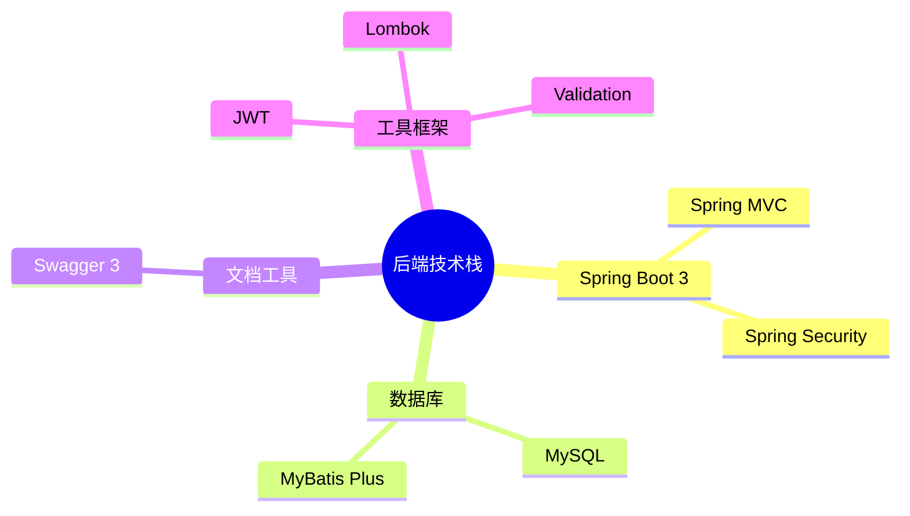
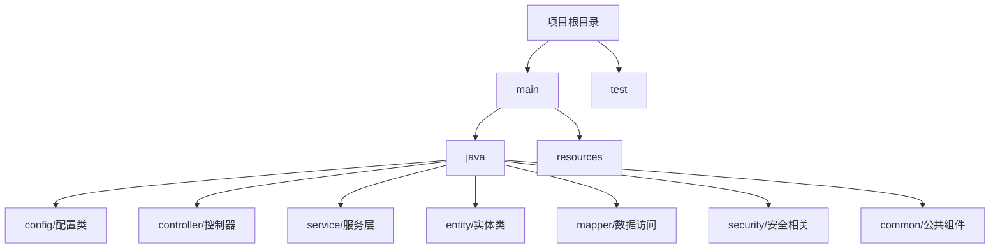

# Spring Boot 3 + MyBatis Plus + Security + JWT 项目教程

> 本教程将指导你从零开始搭建一个基于 Spring Boot 3 的后端项目,包含用户认证、权限控制等基础功能。

## 目录
1. [项目初始化](#1-项目初始化)
2. [整合 MyBatis Plus](#2-整合-mybatis-plus)
3. [集成 Swagger 接口文档](#3-集成-swagger-接口文档)
4. [统一响应处理](#4-统一响应处理)
5. [用户管理功能](#5-用户管理功能)
6. [Spring Security 认证](#6-spring-security-认证)
7. [JWT 令牌集成](#7-jwt-令牌集成)
8. [单元测试](#8-单元测试)

## 项目架构

### 技术选型


### 项目结构


## 1. 项目初始化

### 1.1 创建 Spring Boot 项目

1. 使用 IDEA 创建项目
   - New Project -> Spring Initializr
   - 选择 JDK 17
   - 选择 Spring Boot 3.1.0

2. 添加基础依赖
```xml
<dependencies>
    <!-- Spring Boot Web -->
    <dependency>
        <groupId>org.springframework.boot</groupId>
        <artifactId>spring-boot-starter-web</artifactId>
    </dependency>
    
    <!-- Lombok -->
    <dependency>
        <groupId>org.projectlombok</groupId>
        <artifactId>lombok</artifactId>
        <optional>true</optional>
    </dependency>
    
    <!-- Validation -->
    <dependency>
        <groupId>org.springframework.boot</groupId>
        <artifactId>spring-boot-starter-validation</artifactId>
    </dependency>
</dependencies>
```

### 1.2 配置文件

创建 application.yml:
```yaml
server:
  port: 8080

spring:
  application:
    name: spring-boot-demo
```

### 1.3 创建启动类
```java
@SpringBootApplication
public class Application {
    public static void main(String[] args) {
        SpringApplication.run(Application.class, args);
    }
}
```

### 1.4 创建项目基础结构

1. 在 IDEA 中创建以下目录结构:
```
src/main/java/org/example/
├── common/
│   ├── exception/
│   └── result/
├── config/
├── controller/
├── dto/
│   ├── request/
│   └── response/
├── entity/
├── mapper/
├── security/
│   ├── config/
│   ├── service/
│   └── util/
├── service/
│   └── impl/
└── Application.java
```

2. 创建启动类 `Application.java`:
```java
package org.example;

import org.springframework.boot.SpringApplication;
import org.springframework.boot.autoconfigure.SpringBootApplication;

@SpringBootApplication
public class Application {
    public static void main(String[] args) {
        SpringApplication.run(Application.class, args);
    }
}
```

3. 创建统一响应类 `common/result/R.java`:
```java
package org.example.common.result;

import lombok.AllArgsConstructor;
import lombok.Data;
import lombok.NoArgsConstructor;

@Data
@NoArgsConstructor
@AllArgsConstructor
public class R<T> {
    private Integer code;
    private String message;
    private T data;

    public static <T> R<T> success(T data) {
        return new R<>(ResultCode.SUCCESS.getCode(), ResultCode.SUCCESS.getMessage(), data);
    }

    public static <T> R<T> success() {
        return success(null);
    }

    public static <T> R<T> fail(String message) {
        return new R<>(ResultCode.FAILED.getCode(), message, null);
    }

    public static <T> R<T> fail(ResultCode resultCode) {
        return new R<>(resultCode.getCode(), resultCode.getMessage(), null);
    }

    public static <T> R<T> fail(ResultCode resultCode, String message) {
        return new R<>(resultCode.getCode(), message, null);
    }
}
```

4. 创建业务异常类 `common/exception/BusinessException.java`:
```java
package org.example.common.exception;

import lombok.Getter;

@Getter
public class BusinessException extends RuntimeException {
    private final Integer code;

    public BusinessException(String message) {
        super(message);
        this.code = 500;
    }

    public BusinessException(Integer code, String message) {
        super(message);
        this.code = code;
    }
}
```

5. 创建全局异常处理器 `common/exception/GlobalExceptionHandler.java`:
```java
package org.example.common.exception;

import org.example.common.result.R;
import org.springframework.web.bind.annotation.ExceptionHandler;
import org.springframework.web.bind.annotation.RestControllerAdvice;

@RestControllerAdvice
public class GlobalExceptionHandler {

    @ExceptionHandler(BusinessException.class)
    public R<Void> handleBusinessException(BusinessException e) {
        return R.fail(e.getMessage());
    }

    @ExceptionHandler(Exception.class)
    public R<Void> handleException(Exception e) {
        return R.fail("系统异常，请联系管理员");
    }
}
```

6. 创建配置文件 `src/main/resources/application.yml`:
```yaml
server:
  port: 8080

spring:
  application:
    name: spring-boot-demo
  
  # 数据源配置
  datasource:
    driver-class-name: com.mysql.cj.jdbc.Driver
    url: jdbc:mysql://localhost:3306/test_db?useSSL=false&serverTimezone=Asia/Shanghai
    username: root
    password: root
    
  # 允许循环依赖
  main:
    allow-circular-references: true

# 日志配置
logging:
  level:
    org.example: DEBUG
    org.springframework.web: INFO
```

7. 验证项目配置:
- 确保所有文件都已创建
- 检查包名和目录结构是否正确
- 运行 Application.java 启动项目
- 访问 http://localhost:8080 验证项目是否启动成功

### 1.5 常见问题及解决方案

1. 项目无法启动
```
解决步骤:
1. 检查 JDK 版本是否为 17
2. 确认 pom.xml 中的依赖是否完整
3. 查看启动日志中的具体错误信息
```

2. 包结构问题
```
解决步骤:
1. 确保所有包都在 org.example 下
2. 检查包名是否正确
3. 验证目录结构是否完整
```

3. 配置文件问题
```
解决步骤:
1. 确认 application.yml 文件位置是否正确
2. 检查 yaml 格式是否正确
3. 验证配置项是否符合规范
```

## 2. 整合 MyBatis Plus

### 2.1 添加依赖
在 `pom.xml` 中添加以下依赖:

```xml
<!-- MyBatis Plus -->
<dependency>
    <groupId>com.baomidou</groupId>
    <artifactId>mybatis-plus-boot-starter</artifactId>
    <version>3.5.3.1</version>
</dependency>

<!-- MySQL 驱动 -->
<dependency>
    <groupId>com.mysql</groupId>
    <artifactId>mysql-connector-j</artifactId>
    <scope>runtime</scope>
</dependency>
```

### 2.2 创建数据库和表
执行以下 SQL 脚本:

```sql
-- 创建数据库
CREATE DATABASE IF NOT EXISTS test_db DEFAULT CHARACTER SET utf8mb4 COLLATE utf8mb4_general_ci;

USE test_db;

-- 创建用户表
CREATE TABLE sys_user (
    id BIGINT NOT NULL AUTO_INCREMENT COMMENT '主键',
    username VARCHAR(50) NOT NULL COMMENT '用户名',
    password VARCHAR(100) NOT NULL COMMENT '密码',
    create_time DATETIME DEFAULT CURRENT_TIMESTAMP COMMENT '创建时间',
    PRIMARY KEY (id),
    UNIQUE KEY uk_username (username)
) ENGINE=InnoDB DEFAULT CHARSET=utf8mb4 COMMENT='系统用户表';
```

### 2.3 创建实体类
创建 `entity/SysUser.java`:

```java
package org.example.entity;

import com.baomidou.mybatisplus.annotation.IdType;
import com.baomidou.mybatisplus.annotation.TableId;
import com.baomidou.mybatisplus.annotation.TableName;
import lombok.Data;
import java.time.LocalDateTime;

@Data
@TableName("sys_user")
public class SysUser {
    
    @TableId(type = IdType.AUTO)
    private Long id;
    
    private String username;
    
    private String password;
    
    private LocalDateTime createTime;
}
```

### 2.4 创建 Mapper 接口
创建 `mapper/SysUserMapper.java`:

```java
package org.example.mapper;

import com.baomidou.mybatisplus.core.mapper.BaseMapper;
import org.apache.ibatis.annotations.Mapper;
import org.example.entity.SysUser;

@Mapper
public interface SysUserMapper extends BaseMapper<SysUser> {
}
```

### 2.5 创建服务层
创建 `service/SysUserService.java`:

```java
package org.example.service;

import com.baomidou.mybatisplus.extension.service.impl.ServiceImpl;
import org.example.entity.SysUser;
import org.example.mapper.SysUserMapper;
import org.springframework.stereotype.Service;

@Service
public class SysUserService extends ServiceImpl<SysUserMapper, SysUser> {
}
```

### 2.6 创建控制器
创建 `controller/SysUserController.java`:

```java
package org.example.controller;

import org.example.common.result.R;
import org.example.entity.SysUser;
import org.example.service.SysUserService;
import org.springframework.web.bind.annotation.GetMapping;
import org.springframework.web.bind.annotation.RequestMapping;
import org.springframework.web.bind.annotation.RestController;

@RestController
@RequestMapping("/sys-user")
public class SysUserController {

    private final SysUserService sysUserService;

    public SysUserController(SysUserService sysUserService) {
        this.sysUserService = sysUserService;
    }

    @GetMapping
    public R<SysUser> getSysUser() {
        return R.success(sysUserService.getById(1L));
    }
}
```

### 2.7 创建 Swagger 接口文档
创建 `controller/SwaggerConfig.java`:

```java
package org.example.config;

import org.springframework.context.annotation.Bean;
import org.springframework.context.annotation.Configuration;
import springfox.documentation.builders.ApiInfoBuilder;
import springfox.documentation.builders.PathSelectors;
import springfox.documentation.builders.RequestHandlerSelectors;
import springfox.documentation.service.ApiInfo;
import springfox.documentation.spi.DocumentationType;
import springfox.documentation.spring.web.plugins.Docket;

@Configuration
public class SwaggerConfig {

    @Bean
    public Docket createRestApi() {
        return new Docket(DocumentationType.SWAGGER_2)
                .apiInfo(apiInfo())
                .select()
                .apis(RequestHandlerSelectors.basePackage("org.example.controller"))
                .paths(PathSelectors.any())
                .build();
    }

    private ApiInfo apiInfo() {
        return new ApiInfoBuilder()
                .title("Spring Boot 3 + MyBatis Plus + Security + JWT 项目教程")
                .description("本教程将指导你从零开始搭建一个基于 Spring Boot 3 的后端项目,包含用户认证、权限控制等基础功能。")
                .termsOfServiceUrl("http://localhost:8080")
                .version("1.0")
                .build();
    }
}
```

### 2.8 创建 Spring Security 配置
创建 `security/config/SecurityConfig.java`:

```java
package org.example.config;

import org.springframework.context.annotation.Bean;
import org.springframework.context.annotation.Configuration;
import org.springframework.security.config.annotation.web.builders.HttpSecurity;
import org.springframework.security.config.annotation.web.configuration.EnableWebSecurity;
import org.springframework.security.config.annotation.web.configuration.WebSecurityConfigurerAdapter;
import org.springframework.security.core.userdetails.User;
import org.springframework.security.core.userdetails.UserDetails;
import org.springframework.security.core.userdetails.UserDetailsService;
import org.springframework.security.provisioning.InMemoryUserDetailsManager;

@Configuration
@EnableWebSecurity
public class SecurityConfig extends WebSecurityConfigurerAdapter {

    @Bean
    public UserDetailsService userDetailsService() {
        UserDetails userDetails = User.withDefaultPasswordEncoder()
                .username("admin")
                .password("admin")
                .roles("USER")
                .build();
        return new InMemoryUserDetailsManager(userDetails);
    }

    @Override
    protected void configure(HttpSecurity http) throws Exception {
        http.authorizeRequests()
                .antMatchers("/sys-user").hasRole("USER")
                .anyRequest().authenticated()
                .and()
                .formLogin()
                .and()
                .httpBasic();
    }
}
```

### 2.9 创建 JWT 配置
创建 `security/config/JwtConfig.java`:

```java
package org.example.config;

import io.jsonwebtoken.Jwts;
import io.jsonwebtoken.SignatureAlgorithm;
import org.springframework.security.core.userdetails.UserDetails;
import org.springframework.stereotype.Component;

import java.util.Date;

@Component
public class JwtConfig {

    private static final String SECRET_KEY = "secret";

    public String generateToken(UserDetails userDetails) {
        Date now = new Date();
        Date expiryDate = new Date(now.getTime() + 1000 * 60 * 60 * 10);

        return Jwts.builder()
                .setSubject(userDetails.getUsername())
                .setIssuedAt(now)
                .setExpiration(expiryDate)
                .signWith(SignatureAlgorithm.HS512, SECRET_KEY)
                .compact();
    }
}
```

### 2.10 创建单元测试
创建 `test/SysUserServiceTest.java`:

```java
package org.example.service;

import org.junit.jupiter.api.Test;
import org.springframework.beans.factory.annotation.Autowired;
import org.springframework.boot.test.context.SpringBootTest;
import org.example.entity.SysUser;

import static org.junit.jupiter.api.Assertions.assertNotNull;

@SpringBootTest
public class SysUserServiceTest {

    @Autowired
    private SysUserService sysUserService;

    @Test
    public void testGetSysUser() {
        SysUser sysUser = sysUserService.getById(1L);
        assertNotNull(sysUser);
    }
}
```

## 3. 集成 Swagger 接口文档

### 3.1 添加依赖
在 `pom.xml` 中添加:

```xml
<!-- Swagger 3 -->
<dependency>
    <groupId>org.springdoc</groupId>
    <artifactId>springdoc-openapi-starter-webmvc-ui</artifactId>
    <version>2.3.0</version>
</dependency>
```

### 3.2 创建 Swagger 配置类
创建 `config/SwaggerConfig.java`:

```java
package org.example.config;

import io.swagger.v3.oas.annotations.OpenAPIDefinition;
import io.swagger.v3.oas.annotations.enums.SecuritySchemeType;
import io.swagger.v3.oas.annotations.info.Info;
import io.swagger.v3.oas.annotations.security.SecurityScheme;
import org.springframework.context.annotation.Configuration;

@Configuration
@OpenAPIDefinition(
    info = @Info(
        title = "系统管理接口文档",
        description = "提供用户管理等相关接口",
        version = "1.0"
    )
)
@SecurityScheme(
    name = "Bearer Authentication",
    type = SecuritySchemeType.HTTP,
    bearerFormat = "JWT",
    scheme = "bearer"
)
public class SwaggerConfig {
}
```

### 3.3 创建请求和响应对象
1. 创建 `dto/request/UserCreateRequest.java`:
```java
package org.example.dto.request;

import io.swagger.v3.oas.annotations.media.Schema;
import jakarta.validation.constraints.NotBlank;
import jakarta.validation.constraints.Size;
import lombok.Data;

@Data
@Schema(description = "创建用户请求")
public class UserCreateRequest {
    
    @NotBlank(message = "用户名不能为空")
    @Size(min = 4, max = 20, message = "用户名长度必须在4-20个字符之间")
    @Schema(description = "用户名")
    private String username;
    
    @NotBlank(message = "密码不能为空")
    @Size(min = 6, max = 20, message = "密码长度必须在6-20个字符之间")
    @Schema(description = "密码")
    private String password;
}
```

2. 创建 `dto/request/UserUpdateRequest.java`:
```java
package org.example.dto.request;

import io.swagger.v3.oas.annotations.media.Schema;
import jakarta.validation.constraints.NotBlank;
import jakarta.validation.constraints.Size;
import lombok.Data;

@Data
@Schema(description = "更新用户请求")
public class UserUpdateRequest {
    
    @NotBlank(message = "用户名不能为空")
    @Size(min = 4, max = 20, message = "用户名长度必须在4-20个字符之间")
    @Schema(description = "用户名")
    private String username;
    
    @Size(min = 6, max = 20, message = "密码长度必须在6-20个字符之间")
    @Schema(description = "新密码，不修改则不传")
    private String newPassword;
}
```

3. 创建 `dto/response/UserDetailResponse.java`:
```java
package org.example.dto.response;

import io.swagger.v3.oas.annotations.media.Schema;
import lombok.Data;
import java.time.LocalDateTime;

@Data
@Schema(description = "用户详情响应")
public class UserDetailResponse {
    
    @Schema(description = "用户ID")
    private Long id;
    
    @Schema(description = "用户名")
    private String username;
    
    @Schema(description = "创建时间")
    private LocalDateTime createTime;
}
```

### 3.4 创建控制器
创建 `controller/SysUserController.java`:

```java
package org.example.controller;

import com.baomidou.mybatisplus.core.metadata.IPage;
import com.baomidou.mybatisplus.extension.plugins.pagination.Page;
import io.swagger.v3.oas.annotations.Operation;
import io.swagger.v3.oas.annotations.Parameter;
import io.swagger.v3.oas.annotations.security.SecurityRequirement;
import io.swagger.v3.oas.annotations.tags.Tag;
import jakarta.validation.Valid;
import lombok.RequiredArgsConstructor;
import org.example.common.result.R;
import org.example.dto.request.UserUpdateRequest;
import org.example.dto.response.UserDetailResponse;
import org.example.entity.SysUser;
import org.example.service.SysUserService;
import org.springframework.web.bind.annotation.*;

@Tag(name = "用户管理", description = "用户管理相关接口")
@RestController
@RequestMapping("/api/users")
@RequiredArgsConstructor
@SecurityRequirement(name = "Bearer Authentication")
public class SysUserController {

    private final SysUserService userService;

    @Operation(summary = "分页查询用户")
    @GetMapping
    public R<IPage<UserDetailResponse>> pageUsers(
            @Parameter(description = "页码") @RequestParam(defaultValue = "1") Integer current,
            @Parameter(description = "每页大小") @RequestParam(defaultValue = "10") Integer size,
            @Parameter(description = "用户名") @RequestParam(required = false) String username) {
        Page<SysUser> page = new Page<>(current, size);
        return R.success(userService.pageUsers(page, username));
    }

    @Operation(summary = "获取用户详情")
    @GetMapping("/{id}")
    public R<UserDetailResponse> getUserDetail(@Parameter(description = "用户ID") @PathVariable Long id) {
        return R.success(userService.getUserDetail(id));
    }

    @Operation(summary = "更新用户")
    @PutMapping("/{id}")
    public R<Void> updateUser(
            @Parameter(description = "用户ID") @PathVariable Long id,
            @Valid @RequestBody UserUpdateRequest request) {
        userService.updateUser(id, request);
        return R.success();
    }
}
```

### 3.5 配置 Swagger
在 `application.yml` 中添加:

```yaml
springdoc:
  swagger-ui:
    path: /swagger-ui.html
  api-docs:
    path: /v3/api-docs
  packages-to-scan: org.example.controller
```

### 3.6 验证步骤
1. 启动项目
2. 访问 Swagger UI: http://localhost:8080/swagger-ui.html
3. 检查接口文档是否正确显示
4. 测试接口是否可以正常调用

### 3.7 常见问题

1. Swagger UI 无法访问
```
解决步骤:
1. 确认依赖版本是否正确
2. 检查配置路径是否正确
3. 验证包扫��路径是否正确
```


## 4. 统一响应处理

### 4.1 创建响应码枚举
创建 `common/result/ResultCode.java`:

```java
package org.example.common.result;

import lombok.Getter;

@Getter
public enum ResultCode {
    SUCCESS(200, "操作成功"),
    UNAUTHORIZED(401, "未登录或token已过期"),
    FORBIDDEN(403, "没有相关权限"),
    VALIDATE_FAILED(404, "参数检验失败"),
    FAILED(500, "操作失败"),
    
    ;

    private final Integer code;
    private final String message;

    ResultCode(Integer code, String message) {
        this.code = code;
        this.message = message;
    }
}
```

### 4.2 增强统一响应对象
修改 `common/result/R.java`:

```java
package org.example.common.result;

import lombok.AllArgsConstructor;
import lombok.Data;
import lombok.NoArgsConstructor;

@Data
@NoArgsConstructor
@AllArgsConstructor
public class R<T> {
    private Integer code;
    private String message;
    private T data;

    public static <T> R<T> success(T data) {
        return new R<>(ResultCode.SUCCESS.getCode(), ResultCode.SUCCESS.getMessage(), data);
    }

    public static <T> R<T> success() {
        return success(null);
    }

    public static <T> R<T> fail(String message) {
        return new R<>(ResultCode.FAILED.getCode(), message, null);
    }

    public static <T> R<T> fail(ResultCode resultCode) {
        return new R<>(resultCode.getCode(), resultCode.getMessage(), null);
    }

    public static <T> R<T> fail(ResultCode resultCode, String message) {
        return new R<>(resultCode.getCode(), message, null);
    }
}
```

### 4.3 创建参数验证异常处理
修改 `common/exception/GlobalExceptionHandler.java`:

```java
package org.example.common.exception;

import lombok.Getter;

@Getter
public class BusinessException extends RuntimeException {
    private final Integer code;

    public BusinessException(String message) {
        super(message);
        this.code = 500;
    }

    public BusinessException(Integer code, String message) {
        super(message);
        this.code = code;
    }
}
```

## 6. Spring Security 认证

### 6.1 认证流程说明

#### 1. Security配置
Security配置是整个认证系统的核心，主要用于：
- 配置安全策略
- 设置认证过滤器链
- 配置路由权限
- 配置认证管理器

关键代码：
```java:src/main/java/org/example/security/config/SecurityConfig.java
@Configuration
@EnableWebSecurity
@RequiredArgsConstructor
public class SecurityConfig {
    @Bean
    public SecurityFilterChain filterChain(HttpSecurity http) throws Exception {
        http
            .csrf().disable()
            .sessionManagement().sessionCreationPolicy(SessionCreationPolicy.STATELESS)
            .and()
            .addFilterBefore(jwtAuthFilter, UsernamePasswordAuthenticationFilter.class)
            .authorizeHttpRequests()
                .requestMatchers("/api/auth/**").permitAll()
                .anyRequest().authenticated();
        return http.build();
    }
}
```

#### 2. 认证流程
1. **用户登录请求**
   - 用户提交用户名和密码
   - AuthController接收请求并转发给AuthService

2. **认证处理**
   - AuthenticationManager验证用户凭据
   - UserDetailsService加载用户信息
   - 密码编码器验证密码
   - 生成JWT token

3. **JWT认证过滤**
   - JwtAuthenticationFilter拦截请求
   - 从header提取token
   - 验证token有效性
   - 加载用户信息
   - 设置认证上下文

#### 3. 关键组件说明

1. **JWT过滤器**：
```java
@Component
public class JwtAuthenticationFilter extends OncePerRequestFilter {
    @Override
    protected void doFilterInternal(HttpServletRequest request, 
                                  HttpServletResponse response, 
                                  FilterChain filterChain) {
        try {
            String token = getJwtFromRequest(request);
            if (token != null && jwtUtil.validateToken(token)) {
                String username = jwtUtil.getUsernameFromToken(token);
                UserDetails userDetails = userDetailsService.loadUserByUsername(username);
                SecurityContextHolder.getContext().setAuthentication(
                    new UsernamePasswordAuthenticationToken(
                        userDetails, 
                        null, 
                        userDetails.getAuthorities()
                    )
                );
            }
        } catch (Exception e) {
            log.error("无法设置用户认证", e);
        }
        filterChain.doFilter(request, response);
    }
}
```

2. **认证服务**：
```java
@Service
public class AuthService {
    public R<LoginResponse> login(LoginRequest request) {
        try {
            Authentication authentication = authenticationManager.authenticate(
                new UsernamePasswordAuthenticationToken(
                    request.getUsername(), 
                    request.getPassword()
                )
            );
            String token = jwtUtil.generateToken(authentication);
            return R.success(new LoginResponse(token));
        } catch (AuthenticationException e) {
            return R.fail("用户名或密码错误");
        }
    }
}
```

3. **用户详情服务**：
```java
@Service
public class UserDetailsServiceImpl implements UserDetailsService {
    @Override
    public UserDetails loadUserByUsername(String username) {
        SysUser user = userService.findByUsername(username);
        if (user == null) {
            throw new UsernameNotFoundException("用户不存在");
        }
        return User.builder()
            .username(user.getUsername())
            .password(user.getPassword())
            .authorities("USER")
            .build();
    }
}
```

### 6.2 测试认证流程

可以使用以下测试用例验证认证流程：
```java
@SpringBootTest
@AutoConfigureMockMvc
public class AuthControllerTest {
    @Test
    void testLogin() throws Exception {
        LoginRequest request = new LoginRequest();
        request.setUsername("admin");
        request.setPassword("123456");
        
        mockMvc.perform(post("/api/auth/login")
                .contentType(MediaType.APPLICATION_JSON)
                .content(objectMapper.writeValueAsString(request)))
            .andExpect(status().isOk())
            .andExpect(jsonPath("$.data.token").exists());
    }
}
```